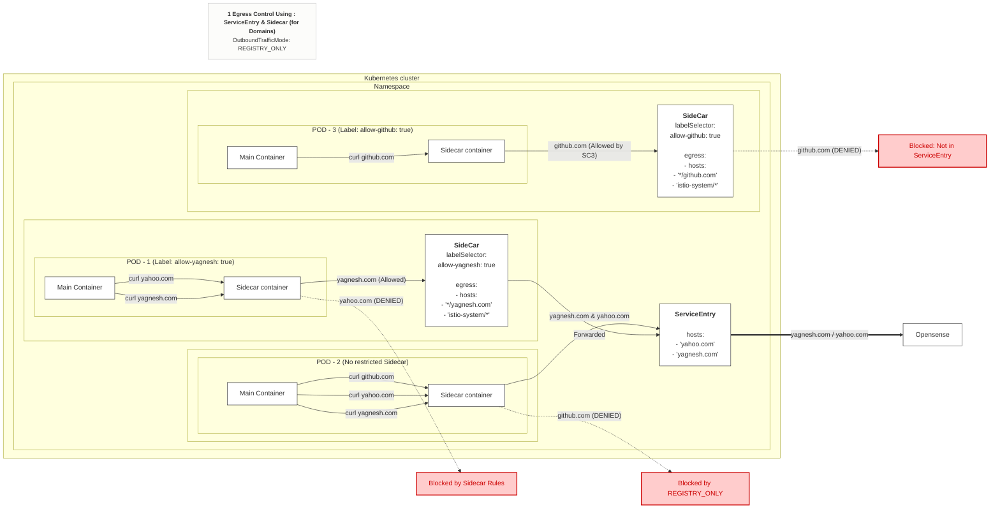
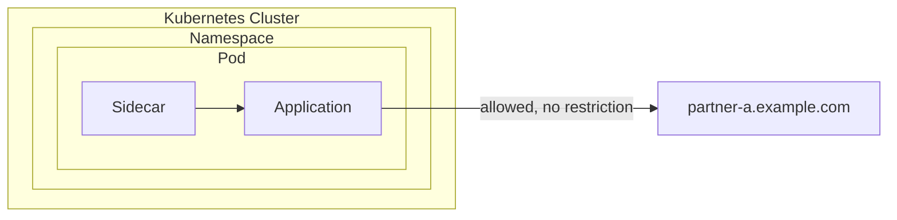
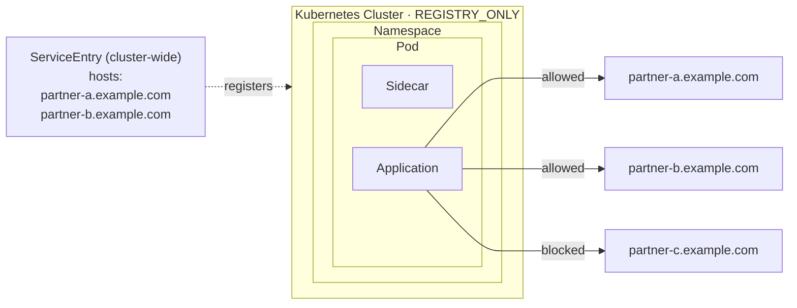
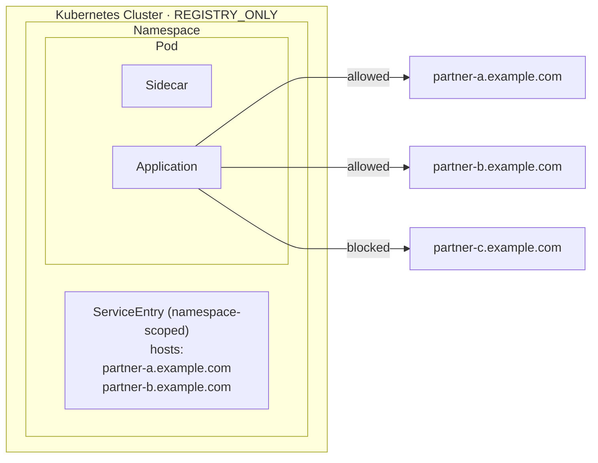
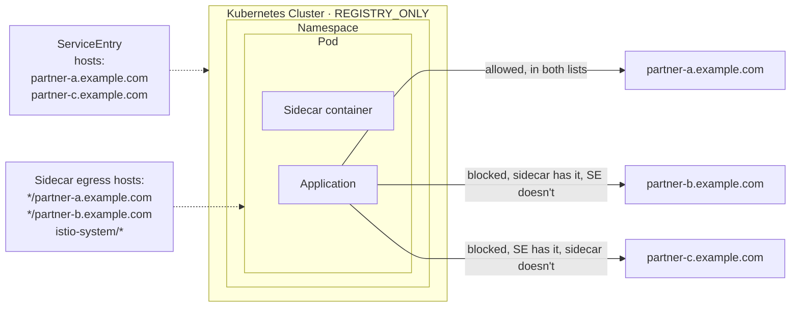
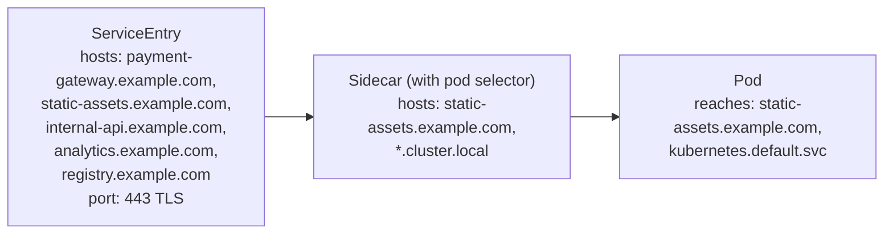
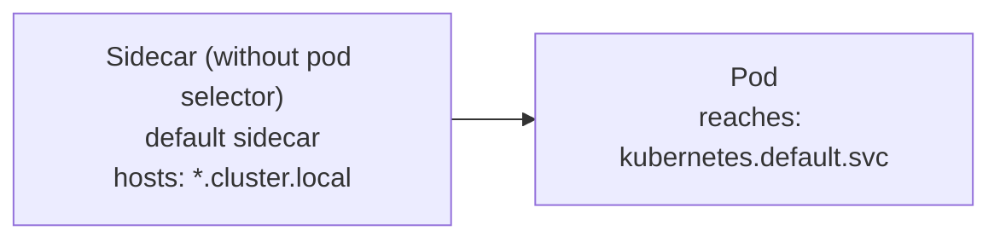
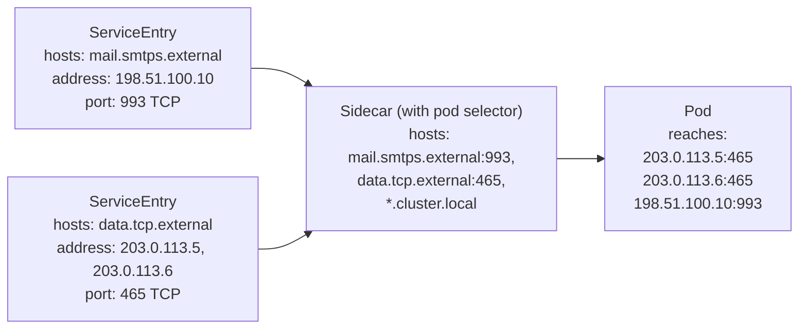
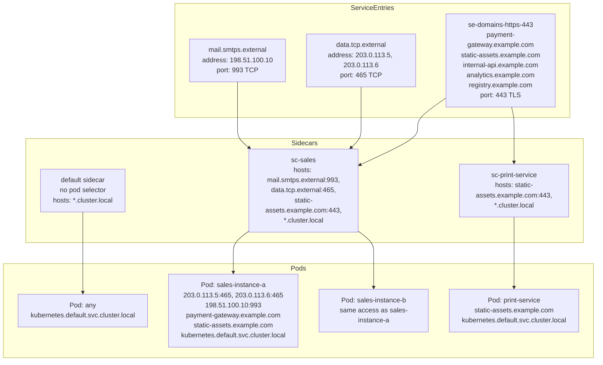
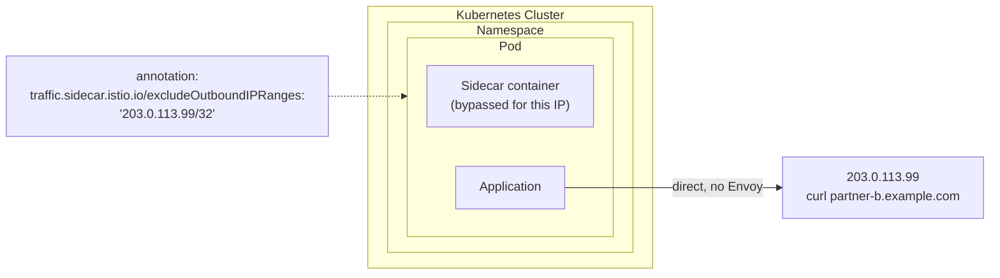

# 🛡️ Istio Egress Control Strategy

## ❓ Why I needed Egress Control

Application pods could call any external domain by default. This is risky because:
- 🚨 A compromised or malicious dependency inside the cluster could exfiltrate data to an external domain (e.g. database dump sent outbound)
- 🕵️ A third-party/open-source app deployed into the cluster could silently call unknown external endpoints
- 🙈 Without restriction, there is no visibility or control over outbound traffic

## 🎯 Goal

Block all egress traffic by default, and allow only specific, explicitly approved external domains — scoped down to the workload/pod level, not just namespace level.

## 🏗️ Egress Architecture Diagram

The diagram below illustrates how we achieve pod-level egress control. `REGISTRY_ONLY` blocks all unknown outbound traffic mesh-wide. A `ServiceEntry` registers an allowed domain, and a `Sidecar` resource specifically binds that access to `Pod: my-app` only.



## 🚥 Istio's 3 Ways to Control Egress

1. 🚪 **Istio Egress Gateway** — centralized egress traffic exit point
2. 📝 **ServiceEntry** — registers allowed external services into the mesh
3. 🏎️ **Sidecar** (optional) — restricts which services/hosts a specific workload's proxy can see

## 🛑 Step 1 — Block All Egress by Default

By default, Istio's `outboundTrafficPolicy` mode is `ALLOW_ANY` (any external domain reachable). Change it to `REGISTRY_ONLY` to block everything not explicitly registered.

**Option A — via IstioOperator**
```yaml
apiVersion: install.istio.io/v1alpha1
kind: IstioOperator
spec:
  meshConfig:
    outboundTrafficPolicy:
      mode: REGISTRY_ONLY
```

**Option B — via istio ConfigMap**
```yaml
apiVersion: v1
kind: ConfigMap
metadata:
  name: istio
  namespace: istio-system
data:
  mesh: |
    outboundTrafficPolicy:
      mode: REGISTRY_ONLY
```

At this point, all outbound traffic is blocked unless registered via a `ServiceEntry`.

## ⚠️ Step 2 — Problem: ServiceEntry Is Not Pod-Level

A `ServiceEntry` registers an allowed external domain into the mesh, but by default its visibility applies at the namespace/mesh level — not scoped to a specific workload/pod. This means once a domain is allowed via ServiceEntry, every pod that can see it may reach it, which is too broad for fine-grained control.

## 💡 Step 3 — Solution: Sidecar Resource + ServiceEntry

To restrict egress access to specific domains **per workload**, combine:
- `ServiceEntry` — to register the allowed external domain
- `Sidecar` resource with `workloadSelector` — to scope which hosts that specific workload's proxy is allowed to see

**ServiceEntry — register the allowed external domain**
```yaml
apiVersion: networking.istio.io/v1beta1
kind: ServiceEntry
metadata:
  name: allow-external-api
  namespace: app-namespace
spec:
  hosts:
    - api.example.com
  ports:
    - number: 443
      name: https
      protocol: TLS
  resolution: DNS
  location: MESH_EXTERNAL
```

**Sidecar — restrict visibility to specific workload (pod-level)**
```yaml
apiVersion: networking.istio.io/v1beta1
kind: Sidecar
metadata:
  name: restricted-egress
  namespace: app-namespace
spec:
  workloadSelector:
    labels:
      app: my-app
  egress:
    - hosts:
        - "./*"
        - "istio-system/*"
        - "app-namespace/api.example.com"
```

This ensures only pods matching `app: my-app` can reach `api.example.com`, while all other workloads in the namespace remain restricted to in-mesh traffic only.

## ✅ Result

- 🧱 All egress blocked by default (`REGISTRY_ONLY`)
- 📋 Explicit allow-list of external domains via `ServiceEntry`
- 🎯 Fine-grained, workload-level enforcement via `Sidecar` + `workloadSelector`
- 🔒 Prevents data exfiltration and unauthorized outbound calls from compromised or untrusted workloads

## 🚀 Advanced Egress Concepts

Based on Istio's architecture, here are the detailed roles of different resources for more advanced egress management:

### 1. Egress Gateways vs Sidecar-Only
While the Sidecar + ServiceEntry approach is great for pod-level restrictions, an **Egress Gateway** (`Gateway` resource) provides a centralized, dedicated exit node for all outbound traffic. 
- **Use Cases**: Useful when you need a static, predictable outgoing IP address (for external firewall whitelisting), or when you want to enforce centralized auditing and observability.
- **Routing**: You use a `VirtualService` to direct egress traffic from the application sidecars to the Egress Gateway, and from there to the external `ServiceEntry`.

### 2. VirtualService in Egress
A `VirtualService` dictates *how* requests to external services are routed. It is essential when directing egress traffic through an Egress Gateway, allowing you to intercept traffic at the pod level, forward it to the gateway proxy, and optionally inject faults, retries, or timeouts.

### 3. ServiceEntry Limitations & External Authorization
- **Pod-Label Routing**: A `ServiceEntry` natively applies globally or per-namespace, but **cannot** restrict access based on the requesting pod's labels. This is why the `Sidecar` resource is strictly required to lock down access at the pod level.
- **HTTPS & External Authorization**: If you route HTTPS traffic through an Egress Gateway and try to enforce L7 external authorization (like OPA or WAF), it **will not work out-of-the-box**. The gateway only sees encrypted TCP traffic (SNI). To enforce path-based HTTP policies on outbound HTTPS traffic, you must perform **TLS Origination** at the egress gateway so it can inspect the decrypted payload.

## 📊 Detailed Egress Diagrams

```markdown
### 1) Default passthrough — ALLOW_ANY
```


```
### 2A) Cluster-level ServiceEntry — REGISTRY_ONLY
```


```
### 2B) Namespace-level ServiceEntry — REGISTRY_ONLY
```


```
### 2C) ServiceEntry + Sidecar resource — AND logic
```


```
### 2D) Internal & external domains — Sidecar with pod selector
```


```
### 2E) Internal domains only — default Sidecar (no pod selector)
```


```
### 2F) External IPs
```


```
### 2G) Full strategy — multiple ServiceEntries + Sidecars + Pods
```


```
### 3) Bypass Envoy entirely — excludeOutboundIPRanges (not used in production)
```


IPs use RFC 5737 documentation ranges (192.0.2.0/24, 198.51.100.0/24, 203.0.113.0/24) — safe placeholders, never routable on the real internet.

## 📚 References

- [StackOverflow: Does Istio ServiceEntry support routing to different hosts by requesting pod label?](https://stackoverflow.com/questions/69634855/does-istio-serviceentry-support-routing-to-different-hosts-by-requesting-pod-lab)
- [StackOverflow: Istio egress gateway with external authorization cannot enforce policy on HTTPS](https://stackoverflow.com/questions/79769417/istio-egress-gateway-with-external-authorization-cannot-enforce-policy-on-https)
- [Gateway](https://istio.io/latest/docs/reference/config/networking/gateway)
- [EgressGateway](https://istio.io/latest/docs/tasks/traffic-management/egress/egress-gateway/)
- [ServiceEntry](https://istio.io/latest/docs/reference/config/networking/service-entry/)
- [Sidecar](https://istio.io/latest/docs/reference/config/networking/sidecar)
- [VirtualService](https://istio.io/latest/docs/reference/config/networking/virtual-service/)
- [Traffic Egress Through Virtualservice 4th point](https://istio.io/latest/docs/tasks/traffic-management/egress/egress-gateway/#egress-gateway-for-http-traffic)
