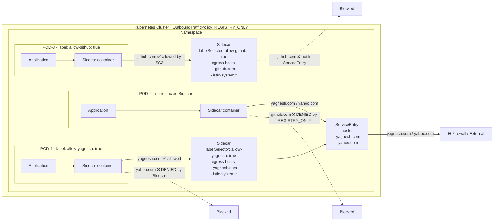
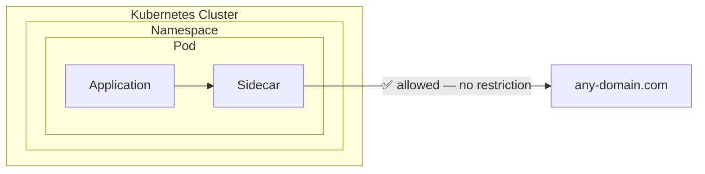
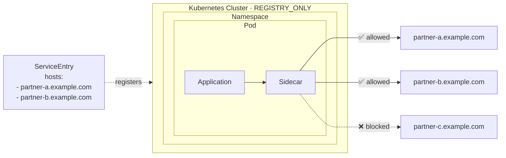
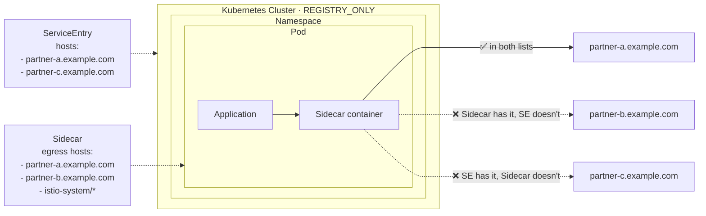
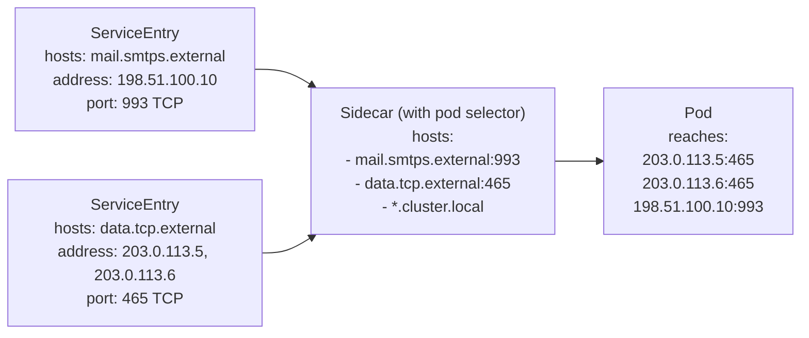
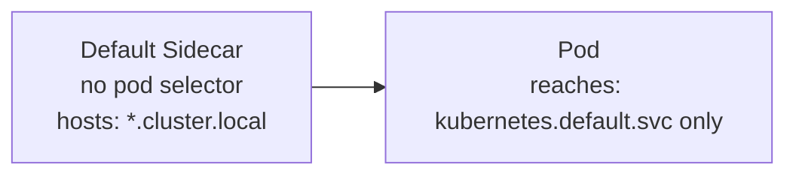

# 🛡️ Blocking Outbound Traffic in Kubernetes with Istio

## ❓ Why Egress Control?

By default, every pod in a Kubernetes cluster can call any external domain freely. This is a serious security risk:

- A compromised dependency can silently exfiltrate your database to an external server
- A third-party app deployed in your cluster can call unknown external endpoints
- Without restriction, you have zero visibility or control over outbound traffic

## 🎯 Goal

Block all egress by default. Allow only explicitly approved external domains — scoped to the specific workload, not the entire namespace.

---

## 🚥 Istio's 3 Ways to Control Egress

| Method | What it does |
|---|---|
| `OutboundTrafficPolicy: REGISTRY_ONLY` | Blocks all external traffic mesh-wide by default |
| `ServiceEntry` | Registers an allowed external domain into the mesh |
| `Sidecar` resource | Scopes which domains a specific workload can reach |

---

## 🛑 Step 1 — Block All Egress by Default

Istio's default mode is `ALLOW_ANY` — every pod can reach any external domain. Change it to `REGISTRY_ONLY` to block everything not explicitly registered.

**Option A — via IstioOperator**
```yaml
apiVersion: install.istio.io/v1alpha1
kind: IstioOperator
spec:
  meshConfig:
    outboundTrafficPolicy:
      mode: REGISTRY_ONLY
```

**Option B — via istio ConfigMap**
```yaml
apiVersion: v1
kind: ConfigMap
metadata:
  name: istio
  namespace: istio-system
data:
  mesh: |
    outboundTrafficPolicy:
      mode: REGISTRY_ONLY
```

After this, all outbound traffic is blocked unless registered via a `ServiceEntry`.

---

## ⚠️ Step 2 — Problem: ServiceEntry is Not Pod-Level

A `ServiceEntry` registers an external domain at the namespace or mesh level. Once registered, every pod in that namespace can reach it — too broad for fine-grained security.

---

## 💡 Step 3 — Solution: ServiceEntry + Sidecar

Combine `ServiceEntry` with a `Sidecar` resource using `workloadSelector` to scope access to a specific pod only.

**ServiceEntry — register the allowed external domain**
```yaml
apiVersion: networking.istio.io/v1beta1
kind: ServiceEntry
metadata:
  name: allow-external-api
  namespace: app-namespace
spec:
  hosts:
    - api.example.com
  ports:
    - number: 443
      name: https
      protocol: TLS
  resolution: DNS
  location: MESH_EXTERNAL
```

**Sidecar — restrict access to a specific workload**
```yaml
apiVersion: networking.istio.io/v1beta1
kind: Sidecar
metadata:
  name: restricted-egress
  namespace: app-namespace
spec:
  workloadSelector:
    labels:
      app: my-app
  egress:
    - hosts:
        - "./*"
        - "istio-system/*"
        - "app-namespace/api.example.com"
```

Only pods with label `app: my-app` can reach `api.example.com`. All other pods in the namespace are still blocked.

---

## 🗺️ How it Works — Full Flow



---

## 🗂️ Scenario Breakdown

### Default — ALLOW_ANY (no control)



---

### REGISTRY_ONLY + ServiceEntry (namespace-wide allow)



---

### REGISTRY_ONLY + ServiceEntry + Sidecar (pod-level control)



---

### External IPs via ServiceEntry



---

### Default Sidecar — internal only



---

## ✅ Result

- All egress blocked by default via `REGISTRY_ONLY`
- Explicit allow-list of external domains via `ServiceEntry`
- Workload-level enforcement via `Sidecar` + `workloadSelector`
- Prevents data exfiltration from compromised or untrusted pods

---

## 🚀 Advanced Concepts

### Egress Gateway vs Sidecar-only
An Egress Gateway provides a centralized exit point for all outbound traffic. Use it when you need a static outgoing IP for external firewall whitelisting, or centralized audit logging. Route traffic from application sidecars to the gateway using a `VirtualService`, then from the gateway to the external `ServiceEntry`.

### ServiceEntry Limitations
A `ServiceEntry` cannot restrict access by pod label natively. This is exactly why the `Sidecar` resource is required for pod-level control.

### HTTPS + External Authorization
If you route HTTPS through an Egress Gateway and want to enforce L7 policies (OPA, WAF), it will not work by default — the gateway only sees encrypted TCP (SNI). You must perform TLS Origination at the egress gateway to inspect decrypted payload.

---

## 📚 References

- [Istio ServiceEntry](https://istio.io/latest/docs/reference/config/networking/service-entry/)
- [Istio Sidecar](https://istio.io/latest/docs/reference/config/networking/sidecar/)
- [Istio Egress Gateway](https://istio.io/latest/docs/tasks/traffic-management/egress/egress-gateway/)
- [Istio VirtualService](https://istio.io/latest/docs/reference/config/networking/virtual-service/)
- [Istio Gateway](https://istio.io/latest/docs/reference/config/networking/gateway/)
