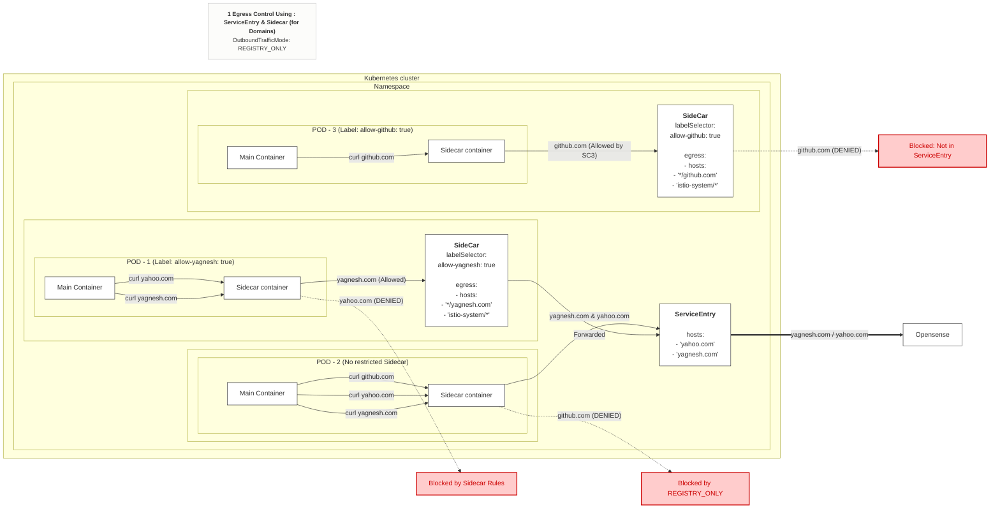

# Istio Egress Control Strategy

## Why I needed Egress Control

Application pods could call any external domain by default. This is risky because:
- A compromised or malicious dependency inside the cluster could exfiltrate data to an external domain (e.g. database dump sent outbound)
- A third-party/open-source app deployed into the cluster could silently call unknown external endpoints
- Without restriction, there is no visibility or control over outbound traffic

## Goal

Block all egress traffic by default, and allow only specific, explicitly approved external domains — scoped down to the workload/pod level, not just namespace level.

## Egress Architecture Diagram

The diagram below illustrates how we achieve pod-level egress control. `REGISTRY_ONLY` blocks all unknown outbound traffic mesh-wide. A `ServiceEntry` registers an allowed domain, and a `Sidecar` resource specifically binds that access to `Pod: my-app` only.



## Istio's 3 Ways to Control Egress

1. **Istio Egress Gateway** — centralized egress traffic exit point
2. **ServiceEntry** — registers allowed external services into the mesh
3. **Sidecar** (optional) — restricts which services/hosts a specific workload's proxy can see

## Step 1 — Block All Egress by Default

By default, Istio's `outboundTrafficPolicy` mode is `ALLOW_ANY` (any external domain reachable). Change it to `REGISTRY_ONLY` to block everything not explicitly registered.

**Option A — via IstioOperator**
```yaml
apiVersion: install.istio.io/v1alpha1
kind: IstioOperator
spec:
  meshConfig:
    outboundTrafficPolicy:
      mode: REGISTRY_ONLY
```

**Option B — via istio ConfigMap**
```yaml
apiVersion: v1
kind: ConfigMap
metadata:
  name: istio
  namespace: istio-system
data:
  mesh: |
    outboundTrafficPolicy:
      mode: REGISTRY_ONLY
```

At this point, all outbound traffic is blocked unless registered via a `ServiceEntry`.

## Step 2 — Problem: ServiceEntry Is Not Pod-Level

A `ServiceEntry` registers an allowed external domain into the mesh, but by default its visibility applies at the namespace/mesh level — not scoped to a specific workload/pod. This means once a domain is allowed via ServiceEntry, every pod that can see it may reach it, which is too broad for fine-grained control.

## Step 3 — Solution: Sidecar Resource + ServiceEntry

To restrict egress access to specific domains **per workload**, combine:
- `ServiceEntry` — to register the allowed external domain
- `Sidecar` resource with `workloadSelector` — to scope which hosts that specific workload's proxy is allowed to see

**ServiceEntry — register the allowed external domain**
```yaml
apiVersion: networking.istio.io/v1beta1
kind: ServiceEntry
metadata:
  name: allow-external-api
  namespace: app-namespace
spec:
  hosts:
    - api.example.com
  ports:
    - number: 443
      name: https
      protocol: TLS
  resolution: DNS
  location: MESH_EXTERNAL
```

**Sidecar — restrict visibility to specific workload (pod-level)**
```yaml
apiVersion: networking.istio.io/v1beta1
kind: Sidecar
metadata:
  name: restricted-egress
  namespace: app-namespace
spec:
  workloadSelector:
    labels:
      app: my-app
  egress:
    - hosts:
        - "./*"
        - "istio-system/*"
        - "app-namespace/api.example.com"
```

This ensures only pods matching `app: my-app` can reach `api.example.com`, while all other workloads in the namespace remain restricted to in-mesh traffic only.

## Result

- All egress blocked by default (`REGISTRY_ONLY`)
- Explicit allow-list of external domains via `ServiceEntry`
- Fine-grained, workload-level enforcement via `Sidecar` + `workloadSelector`
- Prevents data exfiltration and unauthorized outbound calls from compromised or untrusted workloads
