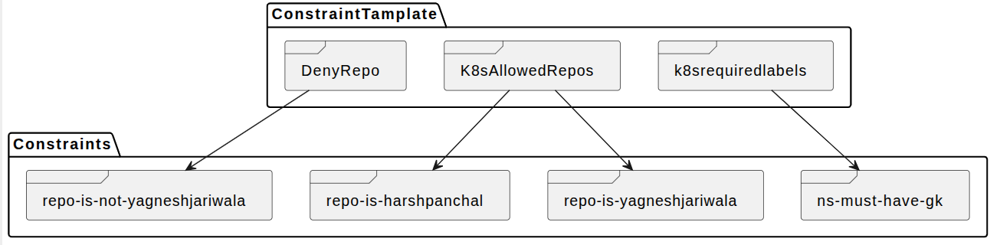

# OPA (Open Policy Agent)
## Index

- [Definition](#definition)
- [When is OPA Used?](#when-is-opa-used)
- [OPA with Kubernetes](#opa-with-kubernetes)
	- [Architecture](#architecture)
- [Enforcement Action](#enforcement-action)
- [GateKeeper](#gatekeeper)
- [CRDs](#crds)
	- [Constraint](#constraint-learn-more)
	- [Mutation](#mutation-learn-more)
- [Audit](#-audit)
- [Replicating Data (Gatekeeper v3.15+ Alpha)](#-replicating-data-gatekeeper-v315-alpha)
- [Exempting Namespaces](#-exempting-namespaces)
- [Metrics & Observability](#-metrics--observability)
- [Emergency Recovery](#-emergency-recovery)
- [ExpansionTemplate](#-expansiontemplate)
- [Enforcement Points](#-enforcement-points)

### Definition

- OPA is a **Policy Decision Engine**.
- You send it **data** and a **question**, and it returns an answer.
- You can write policies using `Rego`.

### How OPA Works
- **Input Data**: You provide facts.
- **Your Policy**: OPA reads the rules.
- **Result**: OPA returns whether the action is allowed or not.

### When is OPA Used?

For example:
- Determining which users can access which resources.
- Controlling which subnets egress traffic is allowed to.
- Specifying which clusters a workload must be deployed to.
- Restricting which registries binaries can be downloaded from.
- Defining which OS capabilities a container can execute with.
- Limiting which times of day the system can be accessed.

## OPA with Kubernetes

### Architecture


OPA can be used as an [Admission Controller](https://kubernetes.io/docs/reference/access-authn-authz/admission-controllers/) in **Kubernetes**.

You can:
- Require specific labels on all resources.
- Ensure container images come from the corporate image registry.
- Require all pods to specify resource requests and limits.
- Prevent conflicting Ingress objects from being created.

As a mutating admission controller, OPA can also:
- Inject sidecar containers into pods.
- Set specific annotations on all resources.
- Rewrite container images to point to the corporate image registry.
## Enforcement Action

`deny` :  as the default behavior is to deny admission requests with any violation

`dryrun` : When rolling out new constraints to running clusters, the dry run functionality can be helpful as it enables constraints to be deployed in the cluster without making actual changes.

`warn` : Warn enforcement action offers the same benefits as dry run, such as testing constraints without enforcing them.

`scoped` : This usually means the constraint or policy is limited to a specific scope, such as a particular namespace, set of namespaces, or specific resources, rather than being applied cluster-wide.


## GateKeeper

OPA Gatekeeper provides integration between OPA and Kubernetes.

OPA Gatekeeper adds the following on top of plain OPA:
- Parameterized policies.
- Native Kubernetes CRDs for instantiating the policy library (`constraints`).
- Native Kubernetes CRDs for extending the policy library (`constraintTemplates`).

[Learn more](https://open-policy-agent.github.io/gatekeeper/website/docs)
## CRDs

### Constraint ([Learn more](https://open-policy-agent.github.io/gatekeeper/website/docs/constrainttemplates))

---



**Constraints** validate Kubernetes objects against policies defined using **ConstraintTemplates**.

- **Constraint**:
	Enforces rules on Kubernetes resources (what is allowed or denied).
	Created from a `ConstraintTemplate`.

	**Examples:**
	- [K8sRequiredLabels](crds/CT/1-CT-K8sRequiredLabels.yaml)
	- [Allowed Images](crds/CT/2-CT-allowed_images.yaml)
	- [Deny Repo](crds/CT/3-CT-denyrepo.yaml)

- **ConstraintTemplate**:
	Blueprint for custom policy logic.
	Defines schema and logic for constraints.

	**Examples:**
	- [Namespace must have label](crds/CT/1-K8sRequiredLabels-ns-must-have-gk.yaml)
	- [Allowed images for pods](crds/CT/2-allowed_images-pod.yaml)
	- [Deny repo example](crds/CT/3-denyrepo-yagnesh.yaml)

---
### Mutation ([Learn more](https://open-policy-agent.github.io/gatekeeper/website/docs/mutation))

Gatekeeper can **mutate** Kubernetes resources at admission time using the following CRDs:

- **AssignMetadata**
	Modifies fields within the `metadata` section of resources.
	[CRD](ref/assign-metadata-crd.yaml)
	_Example:_ [Add admin label](crds/MT/1-MT-add-label-admin.yaml)

- **Assign**
	Modifies fields outside of `metadata`.
	[CRD](ref/assign-crd.yaml)
	_Example:_ [Add IPP always](crds/MT/2-MT-add-IPP-always.yaml)

- **ModifySet**
	Adds or removes entries from list fields (e.g., container arguments).
	[CRD](ref/modifyset-crd.yaml)
	_Example:_ [Add Default Port into Service](crds/MT/3-MT-all-svc-80.yaml)

	**Operations:**
	- `merge`: Insert a value into the list
	- `prune`: Remove a value from the list

- **AssignImage**
	Modifies components of container image strings.
	[CRD](ref/assign-image-crd.yaml)
	_Example:_ [Rewrite image registry](https://open-policy-agent.github.io/gatekeeper/website/docs/mutation/#assignimage)

> Note: [More Examples for Mutation](https://open-policy-agent.github.io/gatekeeper/website/docs/mutation/#examples)


# 🚨 Audit

**Audit** refers to Gatekeeper's background process that **periodically scans existing resources** in your Kubernetes cluster to detect any violations of defined rules (constraints).

> 👉 This helps identify issues that occurred **before Gatekeeper was installed** or that bypassed admission controls.


### 🔍 How to View Violations

Run the following command to see violations:

```bash
kubectl describe k8srequiredlabels.constraints.gatekeeper.sh ns-must-have-gk
```

**Example output:**

```output
Total Violations:  10
Violations:
  Enforcement Action:  deny
  Group:
  Kind:                Namespace
  Message:             you must provide labels: {"gatekeeper"}
  Name:                test
  Version:             v1
```


### 📤 Exporting Violations (Optional)

Gatekeeper can export violations to external systems (such as Pub/Sub, Kafka, etc.).

**Considerations:**

- Some messages may be dropped, especially over unreliable networks.
- Exporting adds extra dependencies (for example, a message queue system).


# 🔁 Replicating Data (Gatekeeper v3.15+ Alpha)

> **🧩 The Problem:**
> Some rules need to see more than just one object (such as Pod, Service, ConfigMap...).

**Example:**
You want to make sure no two Pods have the same label `app-id`.

However, Gatekeeper by default only sees the Pod being created—**not all other Pods.**


### 🔄 Replicating Data with SyncSet

SyncSet is a new and flexible way to say:
> “Please sync these resources (like Pods or Namespaces) so I can use them in my policies.”

```yaml
apiVersion: syncset.gatekeeper.sh/v1alpha1
kind: SyncSet
metadata:
  name: syncset-1
spec:
  gvks:
    - group: ""
      version: "v1"
      kind: "Namespace"
    - group: ""
      version: "v1"
      kind: "Pod"
```

This tells Gatekeeper:

- Sync all Pods
- Sync all Namespaces

🟢 This data will now be available to your Rego policy.


### 📚 How Rego Accesses Synced Data

Once resources (Pods, Namespaces, etc.) are synced, your policy can read them using:

```
data.inventory
```

#### 🏗 Structure

- **Cluster-scoped (e.g., Namespace):**
  ```
  data.inventory.cluster["v1"].Namespace["default"]
  ```
- **Namespace-scoped (e.g., Pod):**
  ```
  data.inventory.namespace["default"]["v1"]["Pod"]["nginx-pod-123"]
  ```


# 🚫 Exempting Namespaces

The config resource can be used as follows to **exclude namespaces from certain processes** for all constraints in the cluster.

```yaml
apiVersion: config.gatekeeper.sh/v1alpha1
kind: Config
metadata:
  name: config
  namespace: "gatekeeper-system"
spec:
  match:
    - excludedNamespaces: ["kube-*", "my-namespace"]
      processes: ["*"]
    - excludedNamespaces: ["audit-excluded-ns"]
      processes: ["audit"]
    - excludedNamespaces: ["audit-webhook-sync-excluded-ns"]
      processes: ["audit", "webhook", "sync"]
    - excludedNamespaces: ["mutation-excluded-ns"]
      processes: ["mutation-webhook"]
...
```

**Available processes:**

- `audit`: Exclude resources from specified namespace(s) in **audit results.**
- `webhook`: Exclude resources from specified namespace(s) from the admission webhook.
- `sync`: Exclude resources from specified namespace(s) from being synced into OPA.
- `mutation-webhook`: Exclude resources from specified namespace(s) from the mutation webhook.
- `*`: Includes all current processes above and includes any future processes.


# 📊 Metrics & Observability

### Observability

[Gatekeeper Observability Docs](https://open-policy-agent.github.io/gatekeeper/website/docs/metrics#observability)

### Metrics

[Gatekeeper Metrics Docs](https://open-policy-agent.github.io/gatekeeper/website/docs/metrics#metrics)


# 🆘 Emergency Recovery

If a situation arises where Gatekeeper is preventing the cluster from operating correctly, the webhook can be disabled:

```bash
kubectl delete validatingwebhookconfigurations.admissionregistration.k8s.io gatekeeper-validating-webhook-configuration
```

Redeploying the webhook configuration will re-enable Gatekeeper.


# 🧩 ExpansionTemplate

Some resources in K8s like Deployment, Job, CronJob, etc. are not directly runnable. They create other resources (like Pods) to actually do the work.

But Gatekeeper only sees the Deployment itself, not the Pod it creates when making decisions.

This problem is solved through **ExpansionTemplate**.


### 📝 Describe

Gatekeeper can now simulate (fake) the Pod that a Deployment would create and check your policies on the fake Pod.


### ⚙️ How it works?

1. You install ExpansionTemplate
2. Gatekeeper sees a Deployment
3. It **creates a fake Pod**
4. Checks if the fake **Pod breaks any rules**
5. If it breaks the rules, **blocks the Deployment**


### 🚫 EnforcementAction in ExpansionTemplate

- Always **Deny**


# 🛑 Enforcement Points

They are the places where Gatekeeper can apply your rules.
Think of them as checkpoints—places where Gatekeeper can check if something follows your policies.


### Types of Enforcement Points

| Enforcement Point           | What it means                                                                                                 |
|-----------------------------|--------------------------------------------------------------------------------------------------------------|
| `validation.gatekeeper.sh`  | Gatekeeper checks when someone tries to **create/update** a resource in the cluster (via webhook)            |
| `audit.gatekeeper.sh`       | Gatekeeper runs background **checks on existing resources** in the cluster                                   |
| `gator.gatekeeper.sh`       | Checks happen **before** anything reaches the cluster — like when using gator CLI to scan YAML files in CI/CD|
| `vap.k8s.io`                | Checks happen using Kubernetes’ built-in Validating Admission Policies (works only with CEL, not Rego)        |
